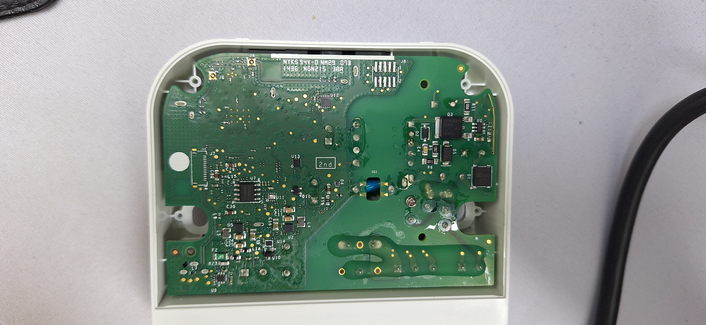
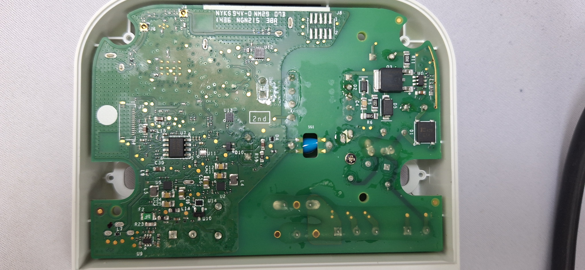
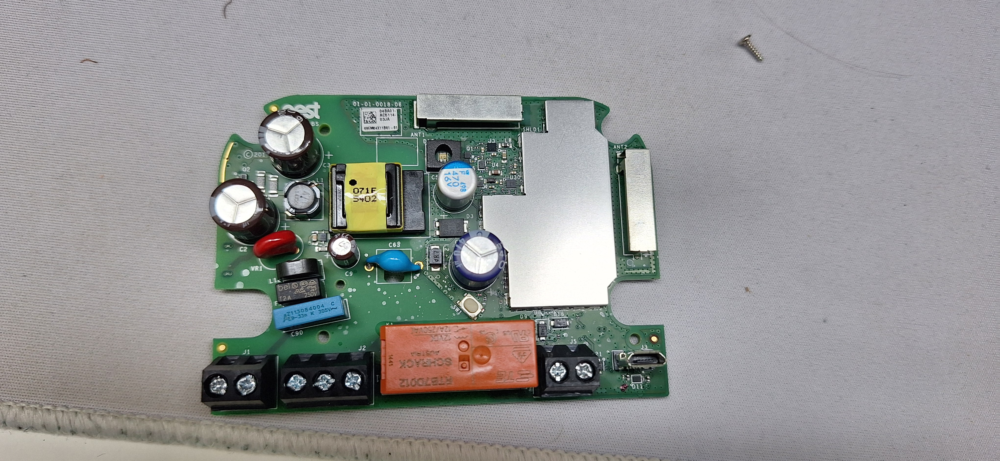
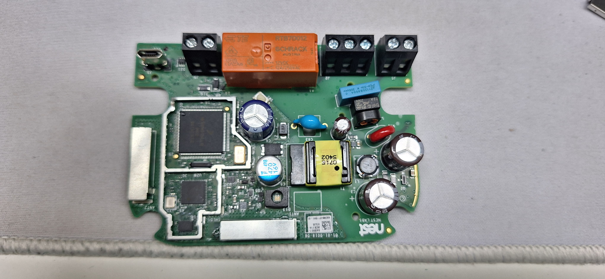

# Hardware

There are at least 2 versions of the backplate, the US version and the UK/EU version.

The backplates have their own processor

## All Backplates

Both versions of the backplate have a 🔴 ST Microelectronics [STM32L151VB](http://www.st.com/web/catalog/mmc/FM141/SC1169/SS1295/LN962/PF248825) 32 MHz ARM Cortex-M3 MCU, colored red in the photos below.

This CPU has its own 128kB of flash memory and runs its own [firmware](Firmware.md).

||
|:--:|
|US backplate|

||
|:--:|
|UK / EU backplate|

## US Backplate

### Spring Terminals

It has 10 wiring connectors. These connectors are switched by FETs. They also have "wire present" sensors in them. The feature of Nest where it detects whether a wire is inserted is physically controlled by a switch in the spring terminal, rather than detecting whether 

For example, in the Star terminal, the 2 pins toward the center of the connector are wired together, and get connected to the Rh wire when the thermostat calls for power on star. 

The 2 other pins are a switch that detects if the terminal is physically pressed down, like it would be if a wire were inserted.

The available wires are Rc, Rh, W1, W2/AUX, Y1, Y2, G, O/B, Common “C”, Star (misc)
[The names of the wires traditionally match the colors of the wires.](https://www.ifixit.com/News/30317/what-all-those-letters-mean-on-your-thermostats-wiring)

#### Power Wires

- **Rh / Rc** - "Red, heating or cooling" - these provide the incoming 28V AC source
- **Common “C”** - provides a path back to the HVAC from Rh/Rc without that power having to route through one of the Command wires. Nest doesn't require a C wire because it can "power sip", but if a C wire is present, it will charge more quickly, and without a C wire there could be problems with erratic calling for heat if the furnace is sensitive

#### Command Wires

- **W1** - White / Heat
- **W2/AUX** - White / Heat / Aux
- **Y1** - Yellow / Air Conditioning 1
- **Y2** - Yellow - Air Conditioning 2
- **G** - Green - Fan
- **O/B** - Orange (Heat Pump)
- **Star** - Miscellaneous - for example, powering a whole-home humidifier or dehumidifier.

## UK / EU Backplate + Heatlink

This backplate version receives 12V DC and provides wired communication with the Heatlink. The wired connection to the heatlink is optional, power to the backplane and nest can be supplied through an micro USB port on the backplane whilst the Heatlink is connected wirelessly through Nest Weave, a Nest thread implementation.

||
|:--:|
|Powered backplate|

||
|:--:|
|Powered backplate + stand|

### Terminals

The UK / EU Backplate has 2 screw terminals for receiving power and facilitates communication with the Heatlink.

#### Wires

- **T1** / **T2** Connected to T1/T2 terminals of the Heatlink

### Heatlink

The heatlink is installed near the central heating appliance / heat valve. The heatlink receives commands from the nest and controls the appliciance through a wired connection. The appliance is controlled with a relais.

When the display cannot find the Heatlink wired / wireless it will display an error.

||
|:--:|
|Heatlink|

||
|:--:|
|Heatlink with cover removed|

#### Heatlink Terminals

||
|:--:|
|Heatlink cover with instructions|

- **T1** / **T2** Connected to the T1/T2 terminals of the backplane, supplies 12V DC
- **N** / **L** Connected to mains power 100V-240VAC ( Neutral and Line )
- **1** Response
- **2** Common
- **3** Demand heat

#### Heatlink PCB

